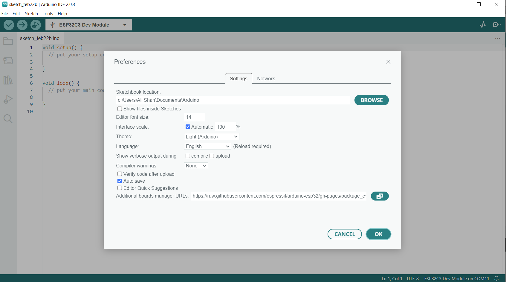
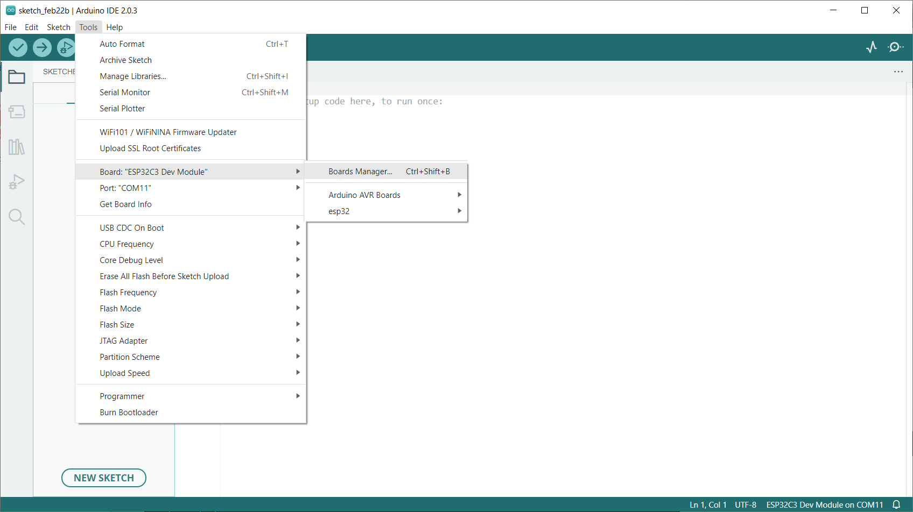
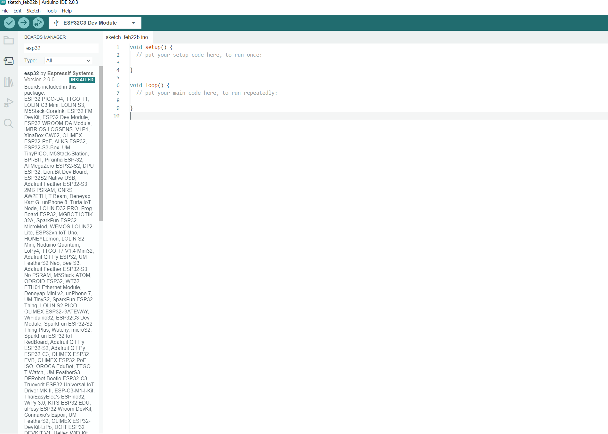
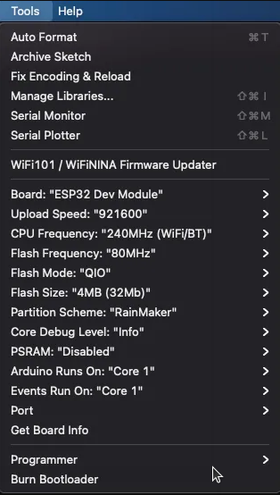

# Demo RainMaker OnOFF Light 
## Introduction 
ESP RainMaker is a sophisticated AIoT solution that provides businesses with a comprehensive yet streamlined platform for deploying private cloud infrastructure. This solution is designed to be lightweight and efficient, enabling organizations to achieve significant cost savings without sacrificing functionality or performance. With ESP RainMaker, businesses can easily and seamlessly integrate AIoT technologies into their operations, allowing them to optimize their processes and gain a competitive edge in their respective markets. Furthermore, ESP RainMaker is built on a robust and reliable architecture, ensuring that businesses can enjoy stable and secure cloud deployments at all times. [Read more about RainMaker](https://rainmaker.espressif.com/)

In this demonstration, we will be utilizing Rainmaker technology to manage the on-board LED of the ESP32 Dev Kit using a mobile phone application.

## Components & Software 

- Arduino IDE or [ESP-IDF](https://github.com/espressif/esp-idf) 
- ESP32 Dev [kit](https://products.espressif.com/#/) 
- IoS 0r Android Mobile to install [RainMaker App](https://rainmaker.espressif.com/docs/quick-links.html#phone-apps)

---

## Configuration of Arduino IDE 

To utilize the Arduino IDE, it is necessary to configure it by downloading the appropriate hardware package for the ESP32.

- **Step 1:** Open Arduino IDE and go to File > Preferences.
<p align="center">
  
</p>


- **Step 2:** In the "Additional Board Manager URLs" field, enter the following URL: 
```
https://raw.githubusercontent.com/espressif/arduino-esp32/gh-pages/package_esp32_index.json.


```
Click "OK" to save the changes.

- **Step 3:** Go to Tools > Board > Boards Manager.
<p align="center">
  
</p>

- **Step 4:** In the search bar, type "ESP32" and click on "ESP32 by Espressif Systems".
<p align="center">
  
</p>

Click "Install" and wait for the installation to complete.


# Description of the Demo 
The demo example illustrates the process of creating a light bulb device that can be utilized in conjunction with ESP RainMaker. 
- This demo example makes use of the Esp32 C3 dev kit with rain maker example.
- The onboard LED is used to turn on and off, while the boot button is internally pullup.
- If the boot button is pressed down for more than 3 seconds, Wi-Fi will be disabled.
- If the boot button is pressed down for more than 10 seconds, a factory reset is triggered.


# Points to remember 

1. Open the Arduino IDE, go to Tools and set the following

<p align="center">
  
</p>

- Board: “ESP32 Dev Module”
- Flash Size: “4MB”
- Partition Scheme: “RainMaker”
- Core Debug Level: “Info”

2. Before commissioning a device Forget the previously connected device with same name in the Bluetooth settings of your mobile phone, as failure to do so may result in errors.

3. Prior to sharing your internet connection, please ensure that your phone is connected to the same network as the device(s) with which you intend to share the connection.
4. Enable erase flash before uploading new sketch 

# Helpful resources 

- [ESP RainMaker Custom Device](https://github.com/espressif/arduino-esp32/tree/master/libraries/RainMaker/examples/RMakerCustom)
- [ESP RainMaker now in Arduino](https://blog.espressif.com/esp-rainmaker-now-in-arduino-cf1474526172)
- [Using RainMaker with Arduino IDE in ESP32](https://www.youtube.com/watch?v=651EoGQHWck)
- [IOT with Arduino IDE and ESP Rainmaker (ESP32, ESP32-S2, ESP32-C3)](https://www.youtube.com/watch?v=g-Mw0-lzxdg&list=PL4Um4E3Og2S8It9Dyhdvf3ScvuTA_Tp-i&index=9)
- [Arduino Project: IOT Devices With ESP32 (ESP Rainmaker)](https://www.youtube.com/watch?v=eYVtHuLk008&list=PL4Um4E3Og2S8It9Dyhdvf3ScvuTA_Tp-i&index=8&t=192s)